<h1>Welcome to mergeminion👋</h1>

**mergeminion** is an app that creates threaded visual merge request Slack messages through a GitLab webhook. Once installed, mergeminion:
- can match **GitLab usernames to Slack usernames** and tag all the users involved in the merge request
- sends merge request updates in a **thread**, instead of a default new message, thus, improving readability 
- is able to work for **multiple teams**, if each team has a separate Slack channel
- helps easily identify **merge request status** that updates based on GitLab activity
- supports **self-hosted GitLab**

### Demo:
_usernames redacted for privacy_

|                                                                                                 |                                                                                               |
|:-----------------------------------------------------------------------------------------------:|:---------------------------------------------------------------------------------------------:|
|                   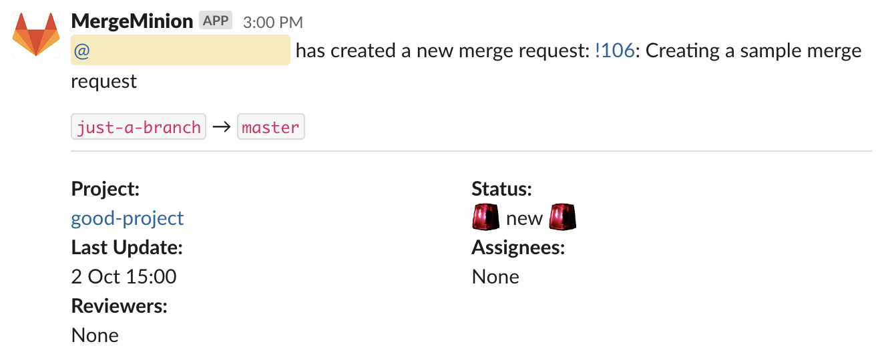  New merge request                    |              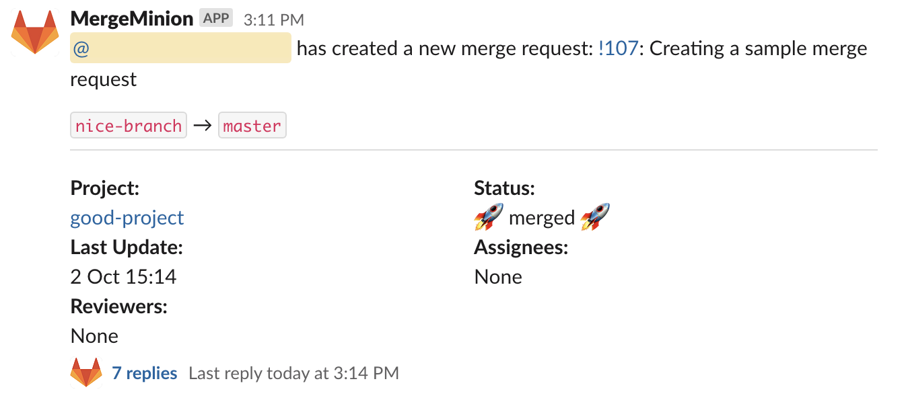  Merge request was merged               |
|                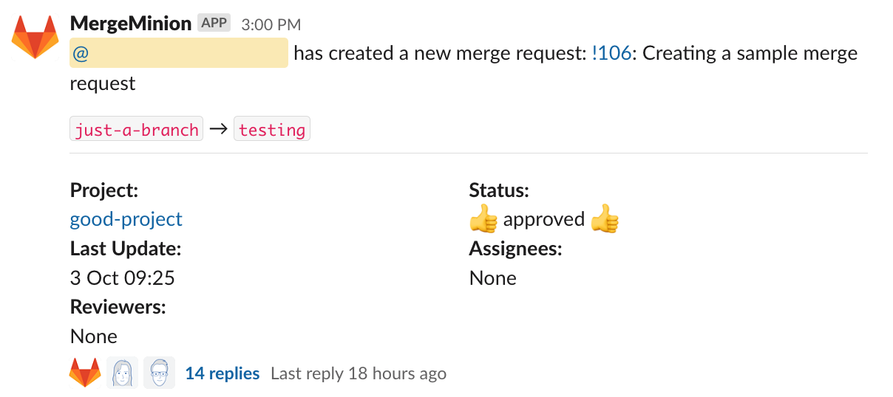  Merge request approved                |            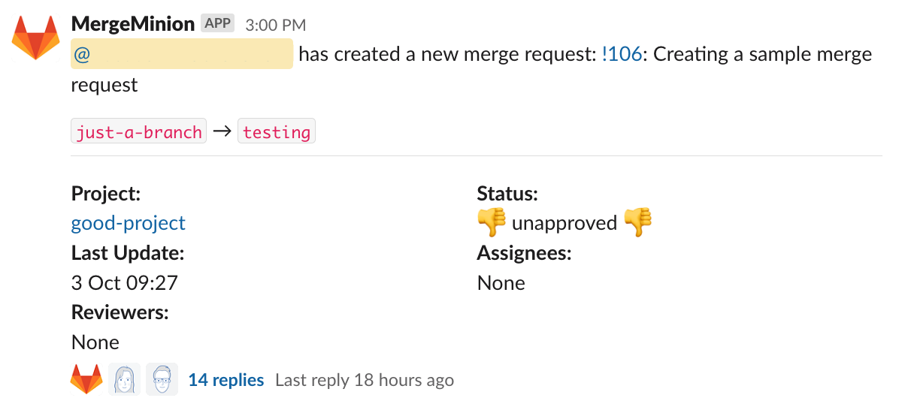  Merge request unapproved             |
|                 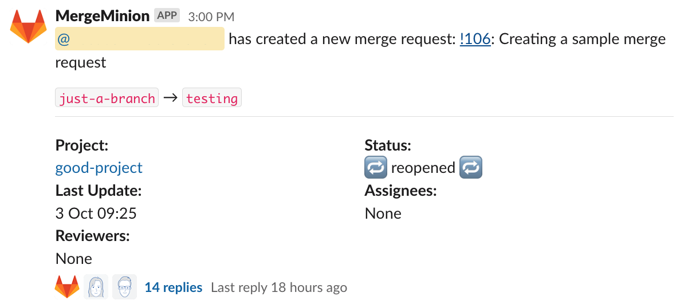  Merge request reopened                 |               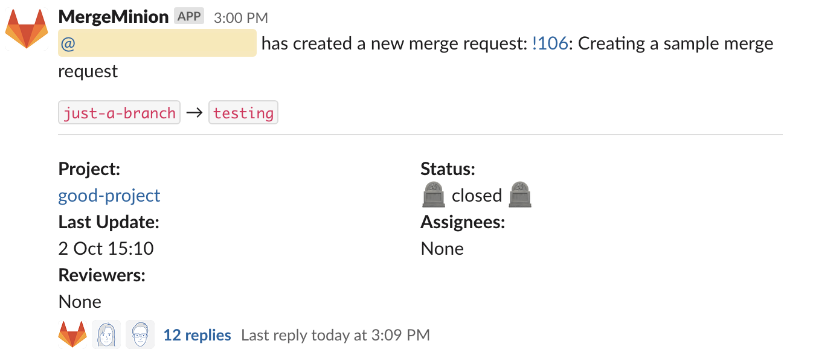 Merge request was closed                |
|             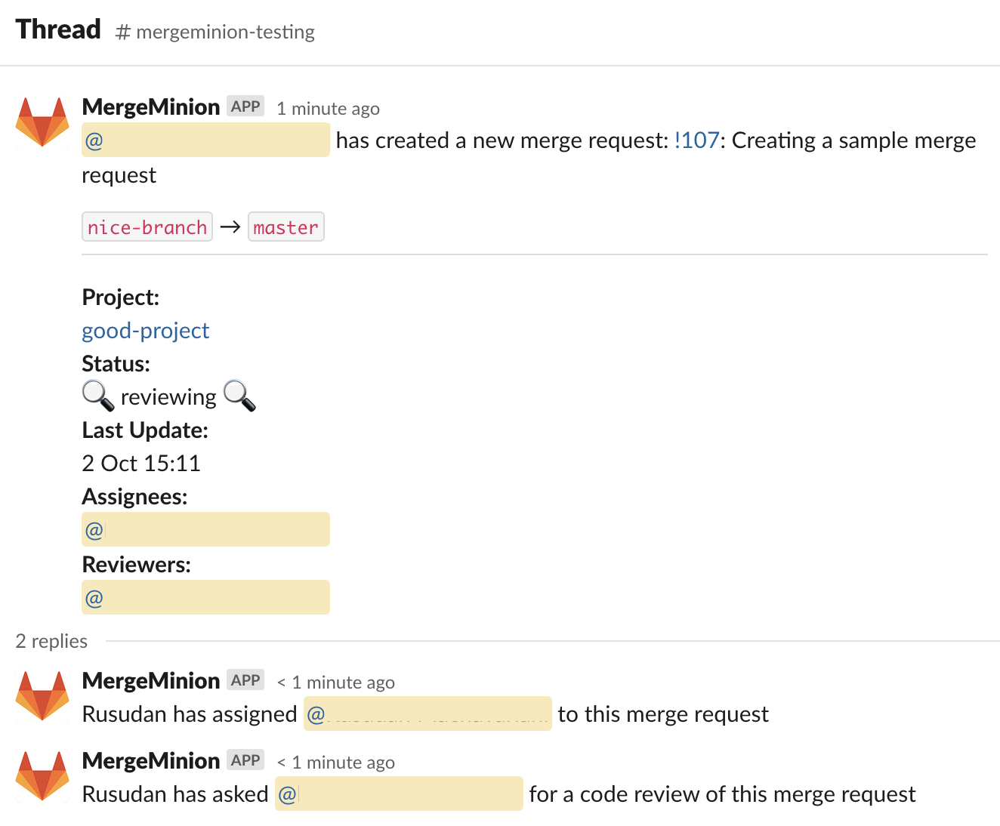  A reviewer has been assigned             |     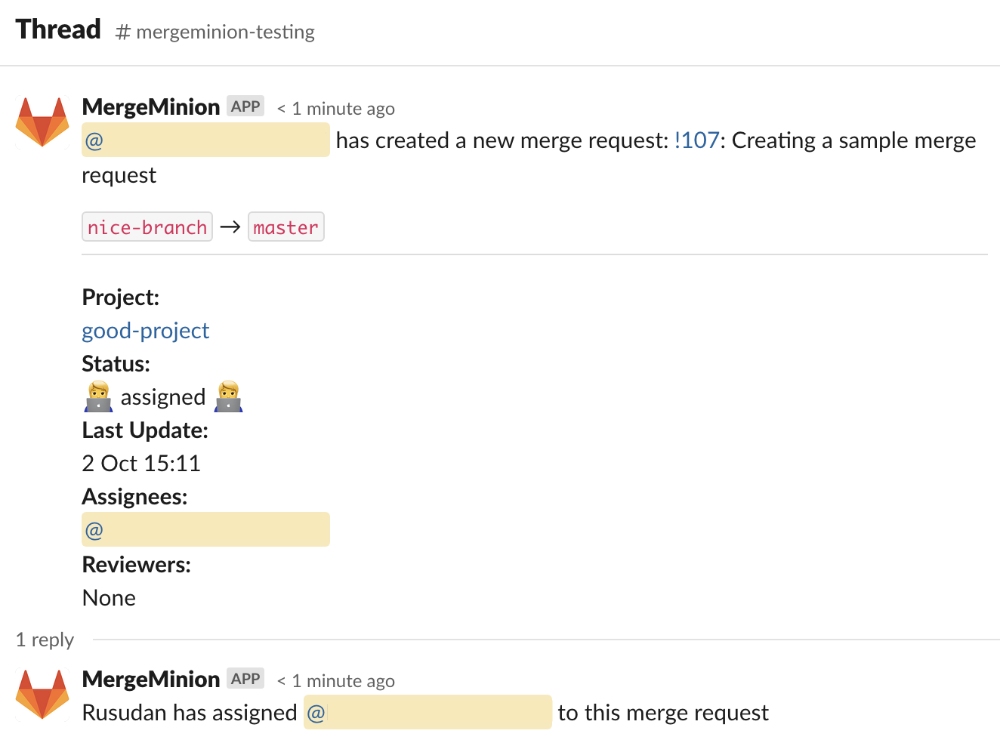      Merge request was assigned to somebody     |
|           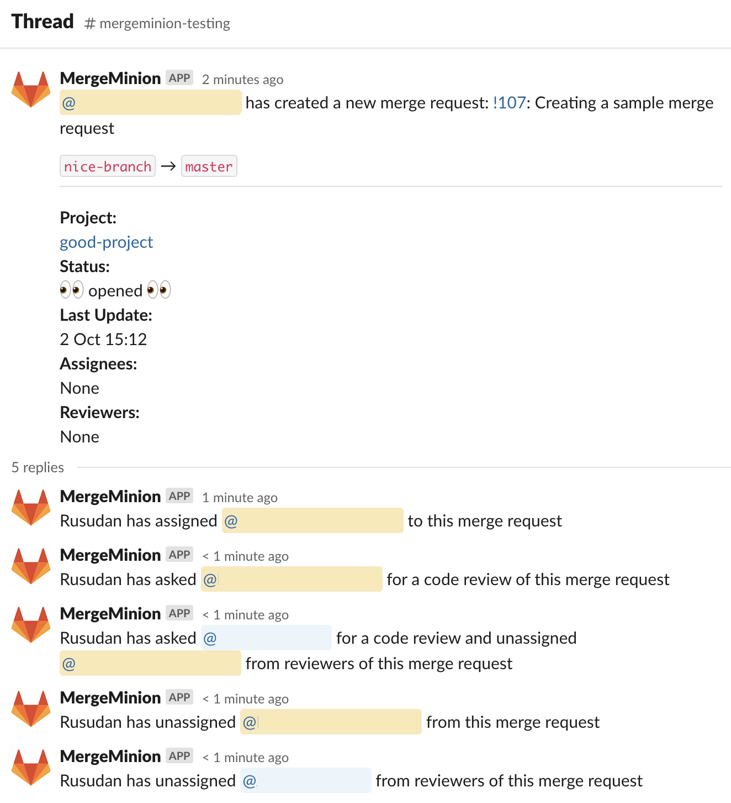  All assignees and reviewers unassigned           |   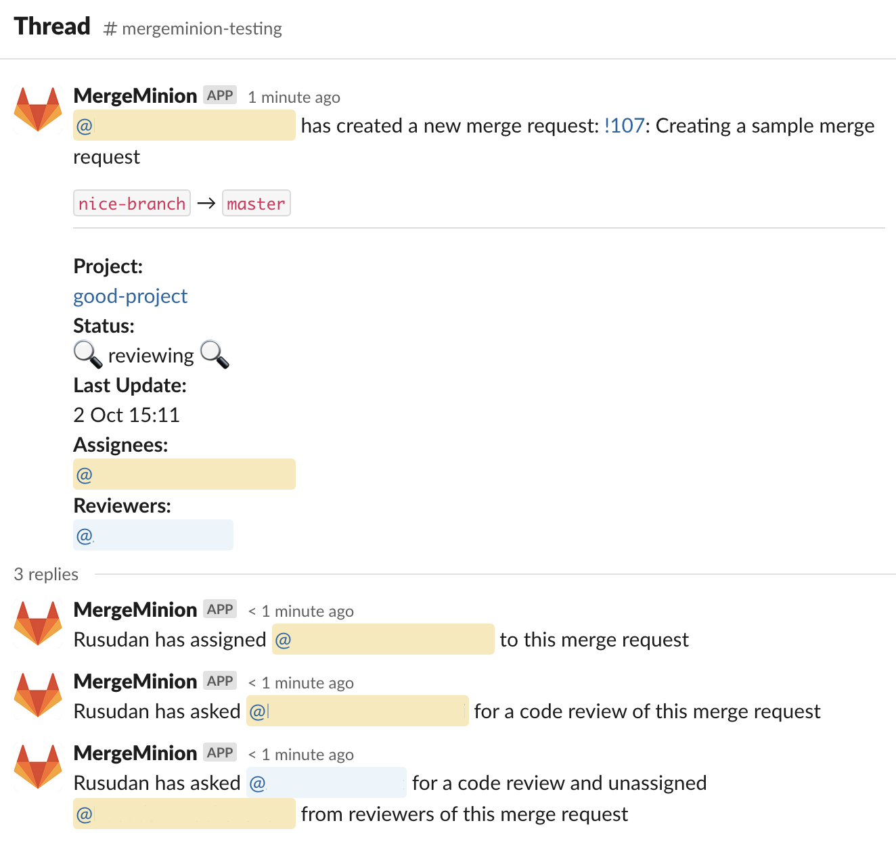    New reviewer assigned, old one unassigned    |
|                  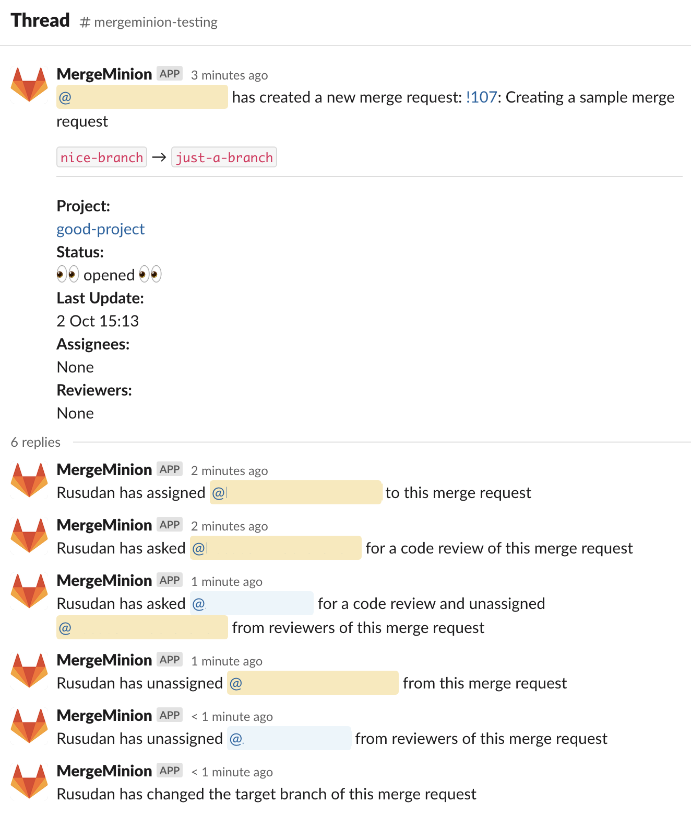   Target branch has changed     | |


# 🛠 Getting started
To run the app on production, you need to deploy it to a server. We run this app on a cluster, you may choose whatever suits you. The app consists of both Flask and Slack Bolt apps, first handling incoming webhook requests, and the other communicating with Slack via Socket Mode. After deploying, add your app URL to `.env` under `BOT_URL` variable. For local development, you can run:
```
$ docker compose up
```
Now, you are receiving requests on this ngrok forwarding URL(save it, you will need to set up your webhooks). Unless you have a paid plan, your forwarding URL will change every time you start the container:

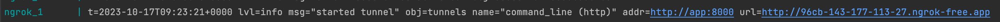

## 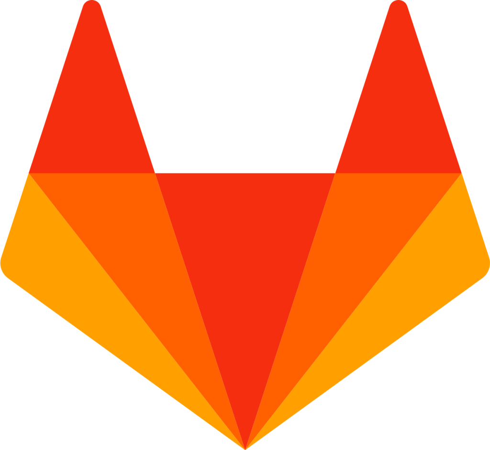 GitLab
- Come up with a token that will authenticate request coming from GitLab and add it as `GITLAB_WEBHOOK_TOKEN` variable

**Connecting 1 project to the app:**

- If you only want to connect a specific project to the app, go the that project, then `Settings->Webhooks->Add new webhook`. Insert your app URL (ngrok forwarding URL for local development) as URL (e.g. `https://test.ngrok-free.app/mr/notify?channel=testing_team`) and `GITLAB_WEBHOOK_TOKEN` value as `Secret token`. Enable Merge request Trigger and SSL Verification

**Connecting multiple projects in bulk to the app:** 

- If you wish to connect all projects within a GitLab group, add your group name to group ID mappings to `GITLAB_GROUP_ID_MAPPING` environmental variable
- Set `ACCESS_GITLAB` to `1`
- Configure `python-gitlab.cfg` with your app user GitLab credentials
- You can now run `update_webhooks.py` to add the merge request webhook to all the projects within a selected group

##  Slack
- Create a new app in your workspace(https://api.slack.com/apps) from app manifest(`mergeminion-manifest.json`) to correctly configure it
- Next, add this Slack app's signing secret (available in the app admin panel under **Basic Information** -> **App Credentials**), bot token (available in the app admin panel under **OAuth & Permissions** -> **OAuth Tokens for Your Workspace** -> **Bot User OAuth Token**), and app token (available in the app admin panel under **Basic Information** -> **App-Level Tokens** -> generate Token and Scopes with all scopes) to your `.env` as `SLACK_SIGNING_SECRET`, `SLACK_BOT_TOKEN`, `SLACK_APP_TOKEN`
- Add all your **team names** to **Slack channel id** mappings as `TEAM_CHANNEL_MAPPING` environmental variable. Team name correspond to the parameter `channel` in your webhook URL
- You now need to add the app to the channels it is going to post to. Go to a channel, **Integrations** -> **Apps** -> **Add an App** 

# 🤖 App settings
There are some settings you can enable to tailor the app to your needs:
- App matches your Slack to GitLab usernames by searching for your GitLab usernames in Slack `name` or `display_name` fields.  If some or none of your GitLab member's usernames match your Slack usernames, you can add custom mapping as `SLACK_GITLAB_USER_MAPPING` variable.
- If you wish to not receive Slack messages when a draft merge request is created, set `EXCLUDE_DRAFT` to `0`, else `1`
- If you wish to create a new merge request Slack thread when a draft merge request was marked as ready, set `NOTIFY_WHEN_MR_READY` to `1`, else `0`

# 👥 Contributors
**mergeminion** is built by <a href="https://www.elnino.tech/">El Niño</a>, a digital development studio in Enschede and The Hague, the Netherlands, that builds custom web and mobile apps, webshops, and more, backed by 14+ years of experience.
